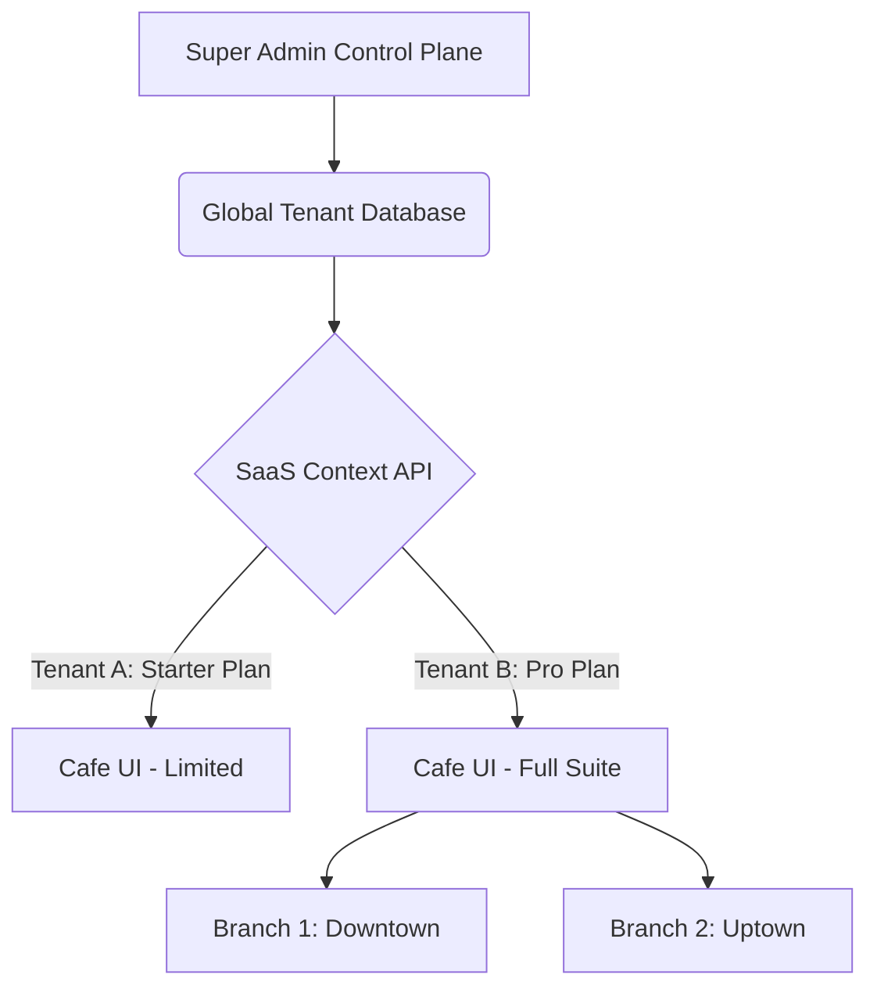

# CafePOS Enterprise Architecture

CafePOS is built on a highly scalable, multi-tenant SaaS architecture optimized for real-time restaurant operations.

## Core Stack
- **Frontend Framework**: React Native (Bare Workflow) 0.74+
- **Language**: TypeScript 5.0+
- **State Management**: Redux Toolkit & Redux Persist
- **Data Fetching**: React Query (TanStack Query v5)
- **UI Library**: React Native Paper (Material Design 3)
- **Charts**: React Native Gifted Charts

## Multi-Tenant Design

The platform uses a unified monolithic frontend that dynamically gates features based on the `SaaSContext`.

## Module Boundaries (Clean Architecture)

Each feature lives in `src/features/` and follows strict Clean Architecture principles:
1. **Presentation Layer**: `screens/`, `components/`, `viewmodels/` (Redux Slices)
2. **Domain Layer**: `entities/` (TypeScript Interfaces), `usecases/`
3. **Data Layer**: `repositories/`, `models/`, `datasources/`

## Offline-First Approach
Using the `OfflineSyncManager` and `redux-persist`, the POS can operate without internet access. Local actions (like placing an order) update the local Redux store and queue a network request. Once online, the `OfflineSyncManager` flushes the queue to the backend.
